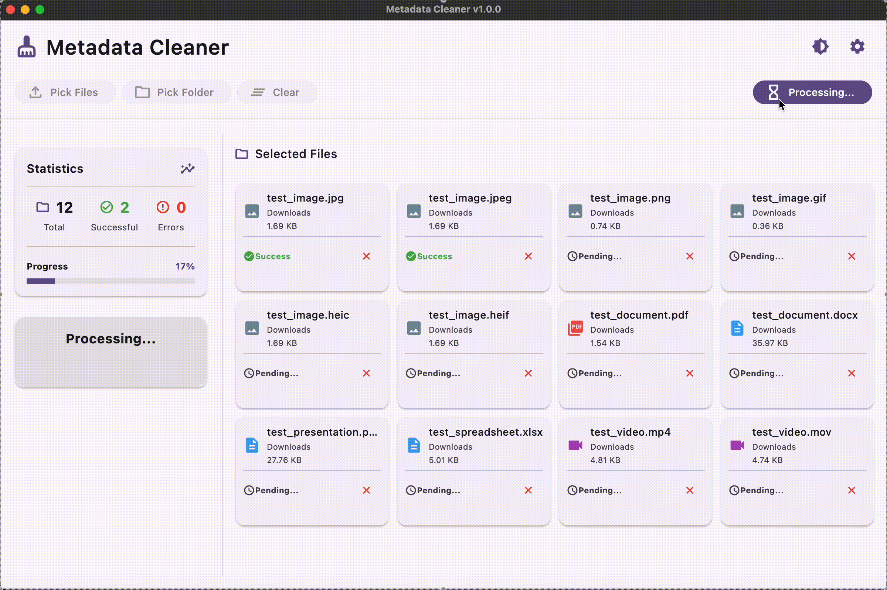
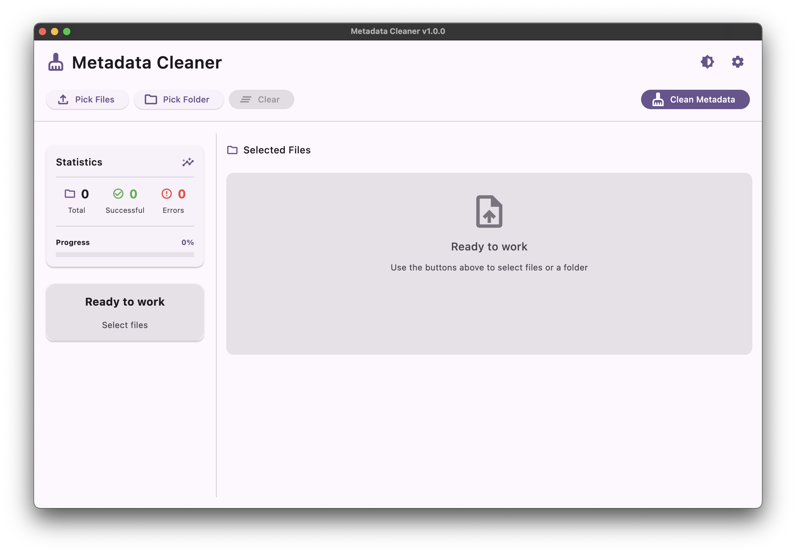
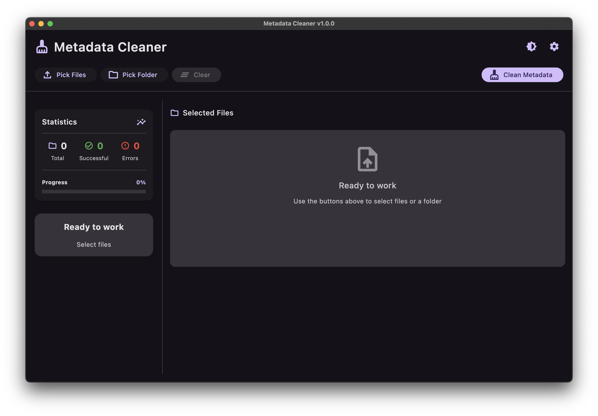
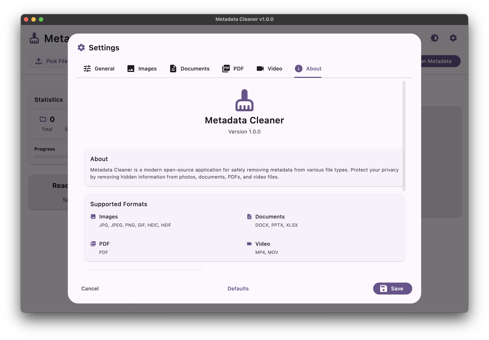

#  Metadata Cleaner

## ✨ Современный инструмент очистки метаданных

### **Удаляйте скрытые данные из ваших файлов**
*Фотографии, документы, PDF и видео — всё обрабатывается локально на вашем компьютере*

<p align="center">
  <a href="https://github.com/AntGalanin06/Metadata_Cleaner/actions/workflows/tests.yml"></a>
  <a href="https://codecov.io/gh/AntGalanin06/Metadata_Cleaner"></a>
  <a href="https://github.com/AntGalanin06/Metadata_Cleaner/releases/latest"></a>
  <a href="https://github.com/AntGalanin06/Metadata_Cleaner/stargazers"></a>
  <a href="LICENSE"></a>
  <a href="https://www.python.org/downloads/"></a>
</p>

<p align="center">
  <strong>🌐 Language:</strong> <a href="README_EN.md">🇺🇸 English</a> | <a href="README.md">🇷🇺 Русский</a>
</p>

---

## 🎬 Демонстрация

<div align="center">
  
</div>

---

## 🖥️ Интерфейс приложения

<div align="center">

### ☀️ Светлая тема


### 🌙 Темная тема  


</div>

<table>
<tr>
<td width="50%">

### ⚙️ **Гибкие настройки**


- **Автоматическое переключение темы** под систему
- **Выбор языка интерфейса** (RU/EN)
- **Настройки резервных копий**
- **Профили очистки метаданных**

</td>
<td width="50%">

### ℹ️ **О приложении**



- **Информация о версии** и обновлениях
- **Ссылки на документацию** и поддержку
- **Поддерживаемые форматы** файлов
- **Контакты разработчика** и обратная связь

</td>
</tr>
</table>

---

## ✨ Ключевые особенности

<table>
<tr>
<td width="50%">

### 🛡️ **Безопасность**
- **100% локальная обработка** — данные не покидают ваш компьютер
- **Автоматические резервные копии** — оригиналы всегда в безопасности
- **Прозрачная работа** — вы видите какие данные удаляются

### 📂 **Удобство использования**
- **Простой выбор файлов** — удобный диалог выбора из системы
- **Пакетная обработка** — обрабатывайте сотни файлов одновременно
- **Селективная очистка** — выберите какие метаданные удалить

</td>
<td width="50%">

### 🎨 **Современный интерфейс**
- **Material 3 дизайн** — красивый и интуитивный
- **Светлая/тёмная темы** — подстройка под систему
- **Мультиязычность** — русский и английский

### ⚙️ **Поддерживаемые форматы**
- **Изображения:** JPG, JPEG, PNG, GIF, HEIC, HEIF
- **Документы:** PDF, DOCX, PPTX, XLSX  
- **Видео:** MP4, MOV

</td>
</tr>
</table>

---

## 🚀 Установка

<table align="center">
<tr>
<td align="center" width="33%">


**[📥 Скачать EXE](https://github.com/AntGalanin06/Metadata_Cleaner/releases/latest/download/MetadataCleaner-Windows.exe)**

`Windows 10+ (64-bit)`

</td>
<td align="center" width="33%">


**[📥 Скачать DMG](https://github.com/AntGalanin06/Metadata_Cleaner/releases/latest/download/MetadataCleaner-macOS.dmg)**

`macOS 10.15+`

</td>
<td align="center" width="33%">


**[📥 Скачать AppImage](https://github.com/AntGalanin06/Metadata_Cleaner/releases/latest/download/MetadataCleaner-Linux.AppImage)**

`Ubuntu 18.04+`

</td>
</tr>
</table>

[🔗 Все релизы и версии](https://github.com/AntGalanin06/Metadata_Cleaner/releases)

---

## 🛠️ Технологии

<div align="center">

### Основной стек


### Сборка и CI/CD


### Обработка файлов


</div>

---

## 🙏 Благодарности
<table>
<tr>
<td width="50%">

### 🖥️ **Интерфейс и GUI**
- [**Flet**](https://flet.dev/) — современный Python UI фреймворк
- [**Material Design**](https://material.io/) — дизайн система от Google

### 📁 **Обработка файлов**
- [**Pillow**](https://pillow.readthedocs.io/) — мощная библиотека для изображений
- [**PyPDF**](https://pypdf.readthedocs.io/) — работа с PDF документами
- [**python-docx**](https://python-docx.readthedocs.io/) — обработка Word документов
- [**openpyxl**](https://openpyxl.readthedocs.io/) — работа с Excel файлами

</td>
<td width="50%">

### 🎬 **Видео и метаданные**
- [**FFmpeg**](https://ffmpeg.org/) — универсальный инструмент для видео
- [**pymediainfo**](https://pymediainfo.readthedocs.io/) — анализ медиа файлов
- [**piexif**](https://piexif.readthedocs.io/) — работа с EXIF данными

### 🛠️ **Разработка и сборка**
- [**Poetry**](https://python-poetry.org/) — управление зависимостями
- [**PyInstaller**](https://pyinstaller.readthedocs.io/) — создание исполняемых файлов
- [**pytest**](https://pytest.org/) — тестирование кода

</td>
</tr>
</table>

---

## 🤝 Участие в разработке

### 📋 Как начать участвовать

#### 🚀 Быстрый старт

```bash
# Форкните репозиторий и клонируйте свою копию
git clone https://github.com/ВАШ_USERNAME/Metadata_Cleaner.git
cd Metadata_Cleaner

# Создайте новую ветку для функции
git checkout -b feature/new-feature

# Установите зависимости
poetry install

# Запустите тесты для проверки
poetry run pytest
```

#### 📝 Рекомендации для участников

- 💬 **Вопросы:** Используйте [GitHub Issues](https://github.com/AntGalanin06/Metadata_Cleaner/issues) для вопросов и обсуждений
- 🧪 **Тестирование:** Покрывайте новый код тестами
- 📖 **Документация:** Обновляйте README при добавлении функций
- 🎨 **Форматирование:** Используйте `black` и следуйте PEP 8

### 🎯 Области для участия

<div align="center">

| Область | Описание | Сложность |
|:---:|:---|:---:|
| 🌍 **Локализация** | Добавление новых языков интерфейса |  |
| 📁 **Расширение форматов** | RAW, TIFF, WebP, аудио, архивы |  |
| 📊 **Детальная статистика** | Улучшение отчетов о метаданных |  |
| 🎨 **Миграция на Tauri** | Переход с Flet на Tauri + React/Vue |  |
| ⚡ **Производительность** | Оптимизация обработки больших файлов |  |
| 🧪 **Тестирование** | Написание unit и integration тестов |  |

</div>

### 💡 Идеи для реализации

<details>
<summary><b>🔥 Приоритетные задачи</b></summary>

- **📁 Расширение форматов:** Поддержка всех популярных типов файлов
  - **Изображения:** RAW (CR2, NEF, ARW), TIFF, WebP, AVIF, BMP
  - **Видео:** AVI, MKV, WMV, FLV, 3GP, M4V, WebM
  - **Аудио:** MP3, FLAC, WAV, OGG, M4A, AAC
  - **Архивы:** ZIP, RAR, 7Z (метаданные в комментариях)
- **📊 Детальная статистика:** Подробная информация о найденных и удаленных метаданных
- **⚙️ Профили очистки:** Настраиваемые шаблоны для разных сценариев использования

</details>

<details>
<summary><b>🌟 Технические улучшения</b></summary>

- **🔍 Предпросмотр метаданных:** Показ содержимого перед удалением
- **🎨 Миграция на Tauri + React/Vue:** Переход на современную архитектуру
  - **🚀 Нативная производительность** — компиляция в системные приложения
  - **📦 Минимальный размер** — в 10 раз меньше чем Electron приложения  
  - **🔒 Повышенная безопасность** — изолированный backend на Rust
  - **⚡ Быстрый запуск** — без дополнительных процессов и окон
  - **🎨 Современный UI** — Material Design 3, анимации, адаптивность

</details>

---

## ❓ Часто задаваемые вопросы

<details>
<summary><b>🔒 Безопасно ли использовать приложение?</b></summary>

Да, абсолютно безопасно! Все файлы обрабатываются локально на вашем компьютере, никакие данные не отправляются в интернет. Приложение автоматически создает резервные копии оригинальных файлов перед очисткой.

</details>

<details>
<summary><b>📁 Какие форматы файлов поддерживаются?</b></summary>

**Текущие форматы:**
- **Изображения:** JPG, JPEG, PNG, GIF, HEIC, HEIF
- **Документы:** PDF, DOCX, PPTX, XLSX
- **Видео:** MP4, MOV

</details>

<details>
<summary><b>🛠️ Что делать если приложение не запускается?</b></summary>

**Частые решения:**
- Проверьте системные требования (Windows 10+, macOS 10.15+, Ubuntu 18.04+)
- Запустите от имени администратора (Windows)
- Разрешите выполнение в настройках безопасности (macOS)
- Сделайте файл исполняемым: `chmod +x MetadataCleaner.AppImage` (Linux)

</details>

<details>
<summary><b>🔄 Можно ли восстановить удаленные метаданные?</b></summary>

Нет, после очистки метаданные удаляются безвозвратно. Поэтому приложение всегда создает резервные копии оригинальных файлов. Найти их можно в папке с обработанными файлами.

</details>

<details>
<summary><b>⚡ Почему некоторые файлы обрабатываются медленно?</b></summary>

Скорость зависит от:
- **Размера файлов** — большие видео обрабатываются дольше
- **Типа метаданных** — сложные EXIF данные требуют больше времени
- **Мощности компьютера** — SSD и больше RAM ускоряют процесс

**О многопоточности:** Приложение использует асинхронную обработку с `asyncio.to_thread()` для выполнения операций в отдельных потоках, что обеспечивает отзывчивость интерфейса без блокировки UI.

</details>

---

## 📄 Документация

- 📋 [**Пользовательское соглашение**](docs/TERMS_OF_SERVICE_RU.md)
- 🔒 [**Политика конфиденциальности**](docs/PRIVACY_POLICY_RU.md)
- ⚖️ [**Лицензия MIT**](LICENSE)

---

## 💝 Поддержите проект

<div align="center">

### ⭐ Если проект оказался полезным — поставьте звездочку!

**Это займет всего 3 секунды, но даст огромную мотивацию для развития проекта** 🚀

### 📢 Расскажите друзьям!

[](https://t.me/share/url?url=https://github.com/AntGalanin06/Metadata_Cleaner&text=🛡️%20Metadata%20Cleaner%20—%20удаляйте%20скрытые%20данные%20из%20ваших%20файлов%20безопасно%20и%20локально!)
[](https://vk.com/share.php?url=https://github.com/AntGalanin06/Metadata_Cleaner&title=🛡️%20Metadata%20Cleaner%20—%20удаляйте%20скрытые%20данные%20из%20ваших%20файлов%20безопасно%20и%20локально!)
[](https://www.instagram.com/)

</div>