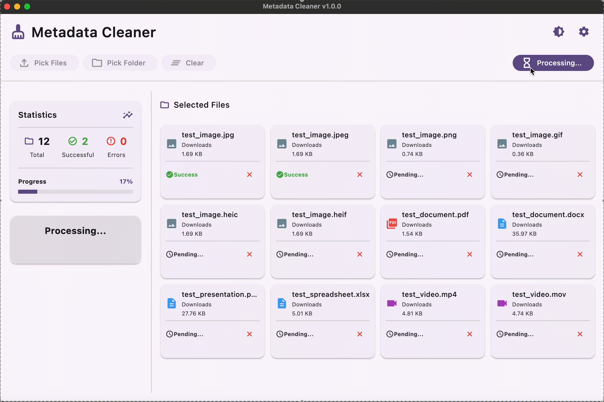
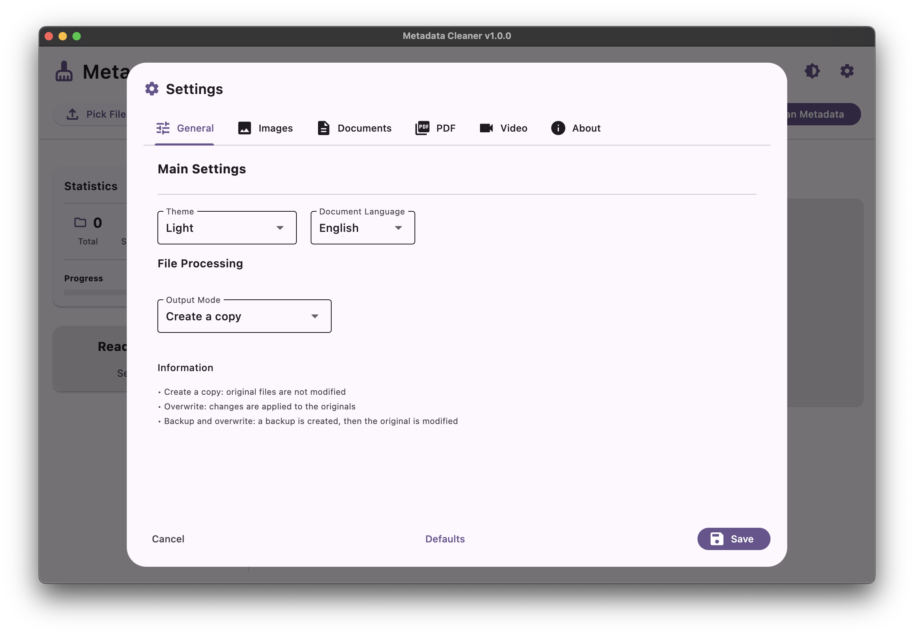

#  Metadata Cleaner

## ✨ Modern metadata cleaning tool

### **Remove hidden data from your files**
*Photos, documents, PDFs and videos — all processed locally on your computer*

<p align="center">
  <a href="https://github.com/AntGalanin06/Metadata_Cleaner/actions/workflows/tests.yml"></a>
  <a href="https://codecov.io/gh/AntGalanin06/Metadata_Cleaner"></a>
  <a href="https://github.com/AntGalanin06/Metadata_Cleaner/releases/latest"></a>
  <a href="https://github.com/AntGalanin06/Metadata_Cleaner/stargazers"></a>
  <a href="LICENSE"></a>
  <a href="https://www.python.org/downloads/"></a>
</p>

<p align="center">
  <strong>🌐 Language:</strong> <a href="README_EN.md">🇺🇸 English</a> | <a href="README.md">🇷🇺 Русский</a>
</p>

---

## 🎬 Demo

<div align="center">
  
</div>

---

## 🖥️ Application Interface

<div align="center">

### ☀️ Light Theme


### 🌙 Dark Theme  


</div>

<table>
<tr>
<td width="50%">

### ⚙️ **Flexible Settings**



- **Automatic theme switching** based on system
- **Interface language selection** (RU/EN)
- **Backup settings**
- **Metadata cleaning profiles**

</td>
<td width="50%">

### ℹ️ **About Application**


- **Version information** and updates
- **Documentation and support** links
- **Supported file formats**
- **Developer contacts** and feedback

</td>
</tr>
</table>

---

## ✨ Key Features

<table>
<tr>
<td width="50%">

### 🛡️ **Security**
- **100% local processing** — data never leaves your computer
- **Automatic backups** — originals are always safe
- **Transparent operation** — you see what data is being removed

### 📂 **Ease of Use**
- **Simple file selection** — convenient system file picker
- **Batch processing** — handle hundreds of files at once
- **Selective cleaning** — choose which metadata to remove

</td>
<td width="50%">

### 🎨 **Modern Interface**
- **Material 3 design** — beautiful and intuitive
- **Light/dark themes** — matches system preferences
- **Multilingual** — Russian and English

### ⚙️ **Supported Formats**
- **Images:** JPG, JPEG, PNG, GIF, HEIC, HEIF
- **Documents:** PDF, DOCX, PPTX, XLSX  
- **Video:** MP4, MOV

</td>
</tr>
</table>

---

## 🚀 Installation

<table align="center">
<tr>
<td align="center" width="33%">


**[📥 Download EXE](https://github.com/AntGalanin06/Metadata_Cleaner/releases/latest/download/MetadataCleaner-Windows.exe)**

`Windows 10+ (64-bit)`

</td>
<td align="center" width="33%">


**[📥 Download DMG](https://github.com/AntGalanin06/Metadata_Cleaner/releases/latest/download/MetadataCleaner-macOS.dmg)**

`macOS 10.15+`

</td>
<td align="center" width="33%">


**[📥 Download AppImage](https://github.com/AntGalanin06/Metadata_Cleaner/releases/latest/download/MetadataCleaner-Linux.AppImage)**

`Ubuntu 18.04+`

</td>
</tr>
</table>

[🔗 All releases and versions](https://github.com/AntGalanin06/Metadata_Cleaner/releases)

---

## 🛠️ Technologies

<div align="center">

### Core Stack


### Build and CI/CD


### File Processing


</div>

---

## 🙏 Acknowledgments

<table>
<tr>
<td width="50%">

### 🖥️ **Interface and GUI**
- [**Flet**](https://flet.dev/) — modern Python UI framework
- [**Material Design**](https://material.io/) — design system by Google

### 📁 **File Processing**
- [**Pillow**](https://pillow.readthedocs.io/) — powerful image processing library
- [**PyPDF**](https://pypdf.readthedocs.io/) — PDF document processing
- [**python-docx**](https://python-docx.readthedocs.io/) — Word document processing
- [**openpyxl**](https://openpyxl.readthedocs.io/) — Excel file processing

</td>
<td width="50%">

### 🎬 **Video and Metadata**
- [**FFmpeg**](https://ffmpeg.org/) — universal video processing tool
- [**pymediainfo**](https://pymediainfo.readthedocs.io/) — media file analysis
- [**piexif**](https://piexif.readthedocs.io/) — EXIF data processing

### 🛠️ **Development and Build**
- [**Poetry**](https://python-poetry.org/) — dependency management
- [**PyInstaller**](https://pyinstaller.readthedocs.io/) — executable creation
- [**pytest**](https://pytest.org/) — code testing

</td>
</tr>
</table>

---

## 🤝 Contributing

### 📋 How to Start Contributing

#### 🚀 Quick Start

```bash
# Fork the repository and clone your copy
git clone https://github.com/YOUR_USERNAME/Metadata_Cleaner.git
cd Metadata_Cleaner

# Create a new branch for your feature
git checkout -b feature/new-feature

# Install dependencies
poetry install

# Run tests to verify setup
poetry run pytest
```

#### 📝 Contributor Guidelines

- 💬 **Questions:** Use [GitHub Issues](https://github.com/AntGalanin06/Metadata_Cleaner/issues) for questions and discussions
- 🧪 **Testing:** Cover new code with tests
- 📖 **Documentation:** Update README when adding features
- 🎨 **Formatting:** Use `black` and follow PEP 8

### 🎯 Areas for Contribution

<div align="center">

| Area | Description | Complexity |
|:---:|:---|:---:|
| 🌠**Localization** | Adding new interface languages |  |
| 📠**Format Expansion** | RAW, TIFF, WebP, audio, archives |  |
| 📊 **Detailed Statistics** | Improving metadata reports |  |
| 🨠**Tauri Migration** | Moving from Flet to Tauri + React/Vue |  |
| ⚡ **Performance** | Optimizing large file processing |  |
| 🧪 **Testing** | Writing unit and integration tests |  |

</div>

### 💡 Implementation Ideas

<details>
<summary><b>🔥 Priority Tasks</b></summary>

- **📁 Format Expansion:** Support for all popular file types
  - **Images:** RAW (CR2, NEF, ARW), TIFF, WebP, AVIF, BMP
  - **Video:** AVI, MKV, WMV, FLV, 3GP, M4V, WebM
  - **Audio:** MP3, FLAC, WAV, OGG, M4A, AAC
  - **Archives:** ZIP, RAR, 7Z (metadata in comments)
- **📊 Detailed Statistics:** Comprehensive information about found and removed metadata
- **⚙️ Cleaning Profiles:** Configurable templates for different use cases

</details>

<details>
<summary><b>🌟 Technical Improvements</b></summary>

- **🔍 Metadata Preview:** Show content before removal
- **🎨 Tauri + React/Vue Migration:** Moving to modern architecture
  - **🚀 Native Performance** — compilation to native applications
  - **📦 Minimal Size** — 10x smaller than Electron apps  
  - **🔒 Enhanced Security** — isolated Rust backend
  - **⚡ Fast Startup** — no additional processes or windows
  - **🎨 Modern UI** — Material Design 3, animations, responsiveness

</details>

---

## ❓ Frequently Asked Questions

<details>
<summary><b>🔒 Is the application safe to use?</b></summary>

Yes, absolutely safe! All files are processed locally on your computer, no data is sent to the internet. The application automatically creates backups of original files before cleaning.

</details>

<details>
<summary><b>📁 What file formats are supported?</b></summary>

**Current formats:**
- **Images:** JPG, JPEG, PNG, GIF, HEIC, HEIF
- **Documents:** PDF, DOCX, PPTX, XLSX
- **Video:** MP4, MOV

**Planned:** RAW formats, TIFF, WebP, AVI, MKV, audio files and more.

</details>

<details>
<summary><b>🛠️ What to do if the application won't start?</b></summary>

**Common solutions:**
- Check system requirements (Windows 10+, macOS 10.15+, Ubuntu 18.04+)
- Run as administrator (Windows)
- Allow execution in security settings (macOS)
- Make file executable: `chmod +x MetadataCleaner.AppImage` (Linux)

</details>

<details>
<summary><b>🔄 Can deleted metadata be restored?</b></summary>

No, after cleaning metadata is permanently removed. That's why the application always creates backups of original files. You can find them in the folder with processed files.

</details>

<details>
<summary><b>⚡ Why do some files process slowly?</b></summary>

Speed depends on:
- **File size** — large videos take longer to process
- **Metadata type** — complex EXIF data requires more time
- **Computer power** — SSD and more RAM speed up the process

**About multithreading:** The application uses asynchronous processing with `asyncio.to_thread()` to perform operations in separate threads, ensuring UI responsiveness without blocking.

</details>

---

## 📄 Documentation

- 📋 [**Terms of Service**](docs/TERMS_OF_SERVICE_EN.md)
- 🔒 [**Privacy Policy**](docs/PRIVACY_POLICY_EN.md)
- ⚖️ [**MIT License**](LICENSE)

---

## 💝 Support the Project

<div align="center">

### ⭐ If you found this project useful — give it a star!

**It takes only 3 seconds, but gives huge motivation for project development** 🚀

### 📢 Tell your friends!

[](https://t.me/share/url?url=https://github.com/AntGalanin06/Metadata_Cleaner&text=🛡️%20Metadata%20Cleaner%20—%20remove%20hidden%20data%20from%20your%20files%20safely%20and%20locally!)
[](https://vk.com/share.php?url=https://github.com/AntGalanin06/Metadata_Cleaner&title=🛡️%20Metadata%20Cleaner%20—%20remove%20hidden%20data%20from%20your%20files%20safely%20and%20locally!)
[](https://www.instagram.com/)

</div> 